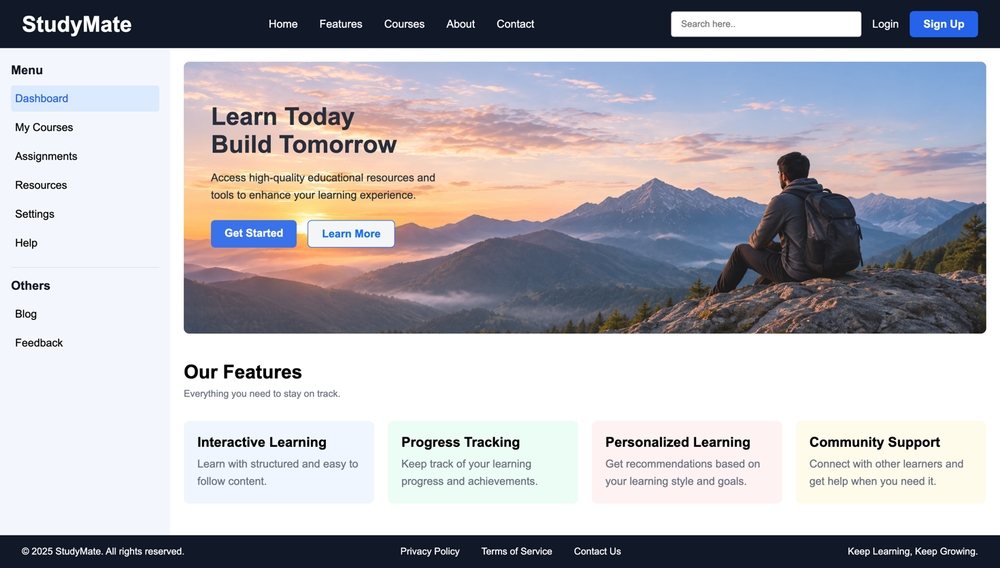

# StudyMate — Landing Page

A static landing page for a fictional e-learning platform, built with plain HTML and CSS.
Practice project focused on page layout: Flexbox for the shell (navbar, sidebar, footer) and
CSS Grid for the feature cards.

## Preview



## Sections

| Section | Description |
| --- | --- |
| **Navbar** | Dark bar with the `StudyMate` logo, five nav links, a search input, a text `Login` link and a filled `Sign Up` button. |
| **Sidebar** | 250px fixed-width panel with a `Menu` group (Dashboard, My Courses, Assignments, Resources, Settings, Help), a divider, and an `Others` group (Blog, Feedback). `Dashboard` is the active item; the rest highlight on hover. |
| **Hero** | 400px banner using `images/hero.png` as a cover background, with the headline "Learn Today / Build Tomorrow", a supporting line and two CTAs (`Get Started`, `Learn More`). |
| **Features** | "Our Features" heading, subtitle, and a four-column grid of cards — Interactive Learning, Progress Tracking, Personalized Learning, Community Support — each with its own pastel background. |
| **Footer** | Dark bar with the copyright, three footer links (underline on hover) and the "Keep Learning, Keep Growing." tagline. |

## Layout notes

- `body` is a column flex container with `min-height: 100vh`, so the footer stays at the bottom.
- `.page` is a flex row with `flex: 1`; the sidebar has a fixed width and `.content` takes the remaining space.
- `.navbar` and `.footer` use `justify-content: space-between` to push their three groups to the edges and center.
- `.features-grid` uses `grid-template-columns: repeat(4, 1fr)` with a 20px gap.

## Color palette

| Token | Hex | Used for |
| --- | --- | --- |
| Ink | `#111827` | Navbar / footer background, headings |
| Blue | `#2563eb` | Primary button, Sign Up, active item text |
| Sidebar | `#F3F7FD` | Sidebar background |
| Active / hover | `#dbeafe` / `#D9E7FD` | Active and hover states in the sidebar |
| Muted text | `#6B7280` | Subtitle and card body copy |
| Card tints | `#eff6ff` `#ecfdf5` `#fef2f2` `#fffbeb` | Feature card backgrounds 1–4 |

## Files

```
Landing-Page/
├── index.html      # page markup
├── style.css       # all styling
├── README.md
└── images/
    ├── hero.png        # hero background
    ├── screenshot.png  # preview above
    └── desk.png
```

## Running it

Open `index.html` in a browser, or serve the folder:

```bash
python3 -m http.server 8000
# then visit http://localhost:8000
```

## Known limitations

- Desktop-only — there are no media queries, so the 4-column grid and 250px sidebar do not adapt to narrow screens.
- All links are `#` placeholders and the search input is non-functional (no JavaScript).
- `.hero` sets `opacity: 0.9` on the whole section, which fades the text along with the background image.
